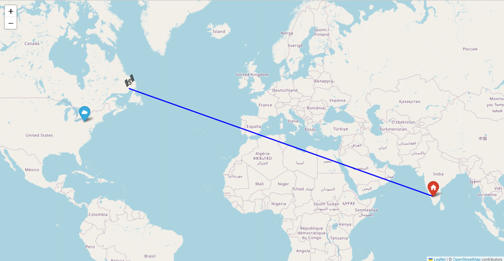

# ISS-position-using-folium
Using python to display ISS position real time on a world map using folium and Geopy library .Displays total distance from the iss to the user location . opens as an brower file
# screenshot

