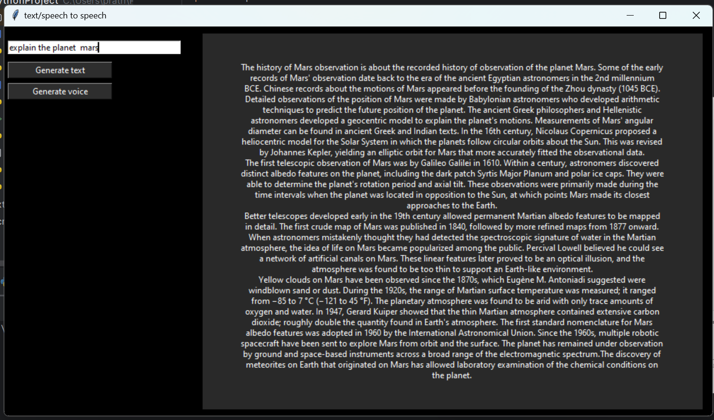
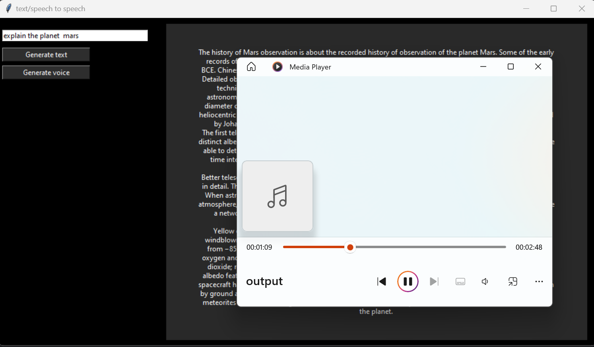

# Wikipedia-text-to-speech-using-python
Python program which takes input from the user and give the collected data from Wikipedia as text or speech using tkinter

# screenshots

# wikipedia result based on search in text
<p1 >

</p1>

# wikipedia result in speech by gtts library
<p2 >

</p2>
